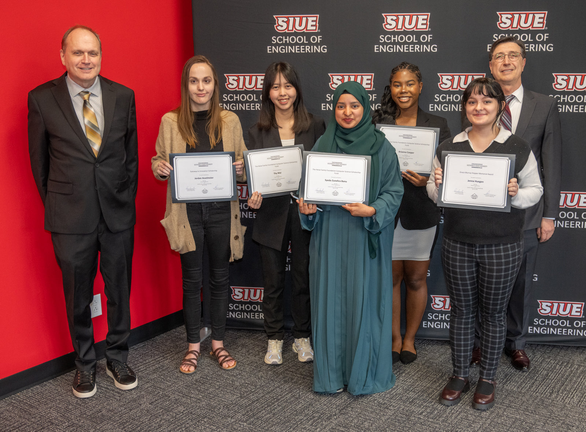

Greetings! This is my personal website where you can learn all about me! Currently, I am a computer science major studying at the Southern Illnois University, Edwardsville. I enjoy programming, gaming, watching horror movies, and much more. 

If you would like to check out my GitHub profile or check out my LinkedIn, check out the links in the sidebar to the left! 

## Education
Currently, I am a junior at SIUE studying computer science. I am proficient in Python, C++, Java, HTML, JavaScript, PHP, SQL, and a little assembly. I love learning new programming languages as well as anything programming related. Recently, I received the Grace Murray Hopper Memorial Award for the Spring 2025 semester! 

<html></html>
